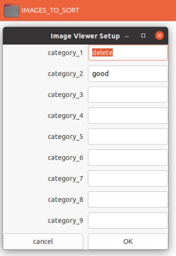

Image Viewer - organize images as fast as possible
==================================================

Note: this is the first TKinter program I ever made. This is a first try, so feel free
to check it out, but don't expect a robust well tested program at this point.
It does work already for me, I use small images (~400kb).

This ImageViewer is made to organize images as fast as possible.
This means: put images in a subdirectory by pressing one key (and immediately navigate to the next one).

I also want to copy the filename in some cases, since I encode parameters in the filename of my images.
'Ctrl-c' will put the current image name (without extension) to the clipboard, so you can paste it elsewhere.
These kind of actions can easily be adjusted in the code. For example, at some point I will write a few lines to parse the parameters from the filename to trigger an action.
So when I browse through my images, I can launch an action based on the current filename parameters on every image that I approve.

Controls
========
<left> and <right> keys to navigate trough image list

[1 - 9] keys will move the current image to the corresponding folder.
By default 1 = delete, 2 = good.
(No real deletion will be done. Only move the file to a folder called 'delete')

<backspace> will undo the last action: put the image back in the main folder

<ctrl-c> will copy the current image name without the extension to the clipboard

<escape> to exit the application


Installation
============

.. code-block:: bash

    $ git clone https://github.com/josvromans/imageviewer.git
    $ cd imageviewer/
    $ virtualenv --python=/usr/bin/python3 env
    $ . env/bin/activate
    $ pip install -r requirements.txt

By default, the imageviewer expects a folder called `files` in the root directory.
Make it, and place your images there.

.. code-block:: bash

    $ mkdir files

In case python Tkinter is not installed on your system, install it:

.. code-block:: bash

    $ apt-get install python3-tk

Make sure you have a files directory with actual images in it with the allowed extension (jpg by default).
Then launch the program:

.. code-block:: bash

    $ python image_viewer.py


Configuration and settings
==========================
Only images with a specific extension are considered. Jpeg is the default, if you want other extensions, you can
specify it in settings.py:

```
DEFAULT_ALLOWED_EXTENSIONS = ['jpg', 'jpeg']
```

Only image files in one directory will be considered. You can select a directory in a dialog when you launch the program.
You can also skip this step by specifying the `SOURCE_DIRECTORY` in the settings. Change it from `None` to an existing path:

```
SOURCE_DIRECTORY = '/home/user/Pictures/categorize_this/'
```

The `DEFAULT_ACTION_NAMES` will be bound to the keys [1-9]. By default 1 = delete and 2 = good, but you can use
any label you want by changing in `settings.py`

```
DEFAULT_ACTION_NAMES = ['delete', 'good']
```

Note that a subdirectory will be made for each label, with exactly the name of the label. When you have several names
with the same label, there will be several keys that will perform the same action: move an image to the same folder.
For now, the action will be bound to the keys 1-9 so you can not add more then 9 actions. If you want more freedom
you need to change some code in image_viewer.py


Add ImageViewer to Nautilus File menu (on Linux Ubuntu)
=======================================================
See the comment on top of the file 'nautilus launcher'.
You can right click on any folder, to start the image viewer to organize that specific folder. In the prompt manu, you can fill in up to 9 categories. Default is just two, for GOOD and DELETE.





TODO
====
Since this is a first try, there are many things to improve, for example:

- Make a key-binding setup in the UI.
- Resize images when changing the window
- Make a decent python package: add a license, packaging, setup etc....
- Add tests
- refactor and restructure code.
- etc
